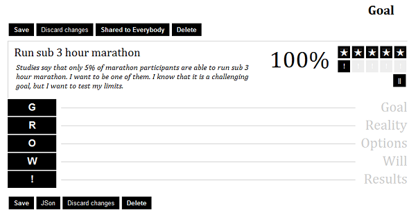
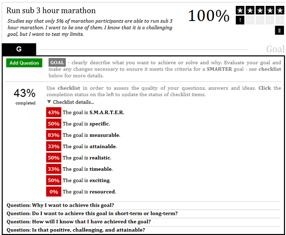
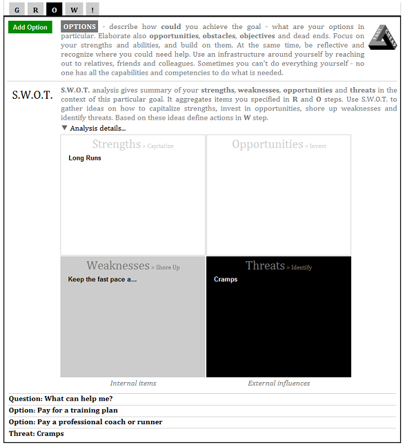
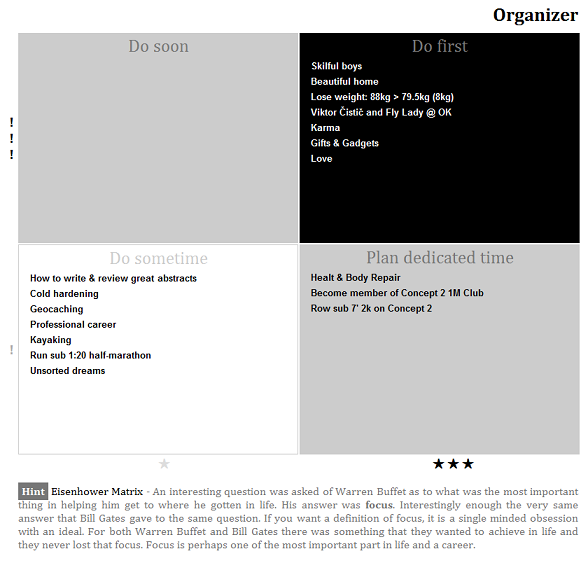
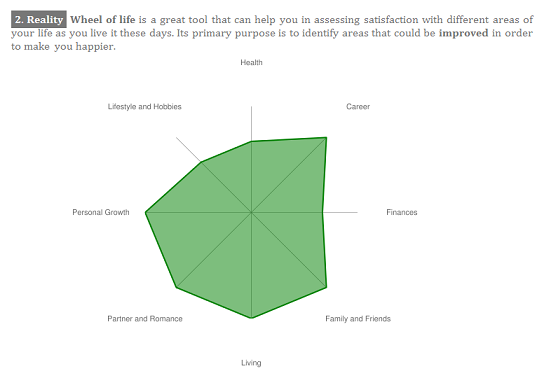

Coaching Notebook
=================

Do want to start a new business, find a new partner for life, change your career, run sub 3 hour marathon or lose 25 pounds? Any tough problem? Need to make up your mind? CoachingNotebook will help you to find the solution.

How do you track progress on your goals between sessions with your life coach? Are you a professional coach? How do you interact with your clients?

**CoachingNotebook** is a problem solver, outliner and auto-coaching notebook."

https://coaching-notebook.mindforger.com
# G.R.O.W. Model

# S.M.A.R.T.E.R. Goals

# S.W.O.T. Analysis

# Eisenhower Matrix

# Wheel of Life

# Installation
Build:

* [build on Linux](DEVELOPER_GUIDE.md)

# Bugs and Feature Requests
https://github.com/dvorka/coaching-notebook/issues

